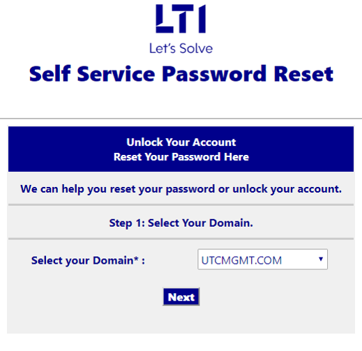
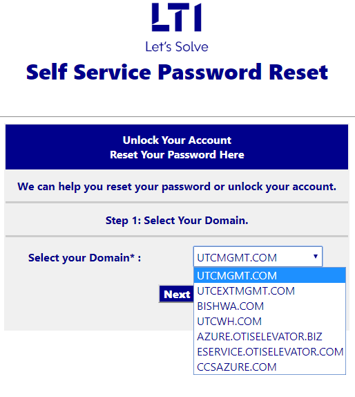
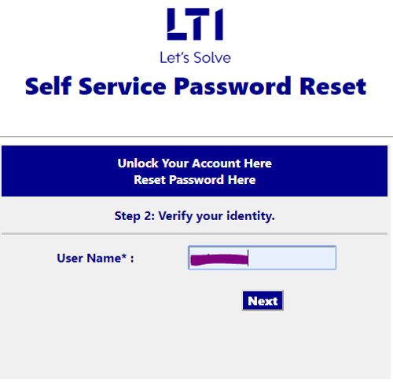
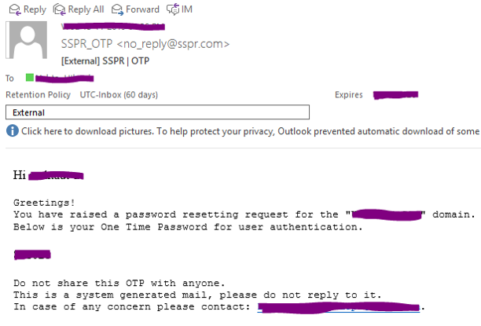
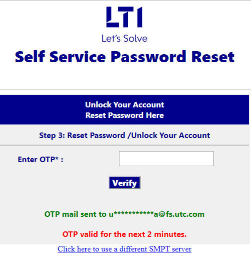
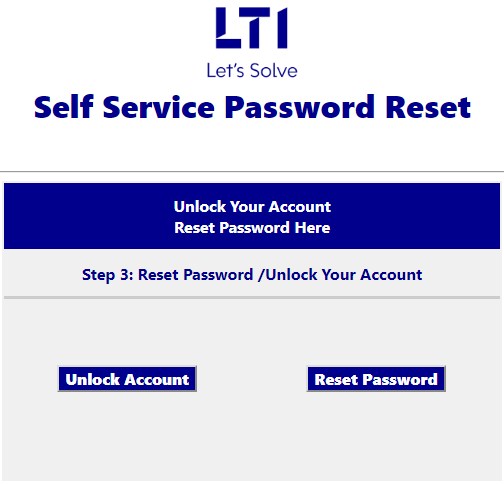
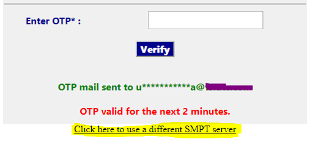

# SSPR Workflow

## 1. Go to https://sspassreset.azurewebsites.net

## Select a domain and click "Next"

## Enter your username and click "Next"

## You will receive an OTP. Copy it

## Paste it. "Verify" it

## Choose

### Choice A: Unlock account

Your account will be unlocked

### Choice B: Reset Password

- Your password is reset
- You receive an email with the attached photo of the password

## Face an issue?

- There was a technical issue while sending the mail.
  - You can choose to use a different SMPT account by clicking the link below the main form

- If you face any issue other than mails not getting sent, simple contact the team that the application proposes.
  - Send a mail to the team, along with a screen shot of the error.