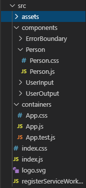

# ReactJS Notes

###### [Course](https://www.udemy.com/course/react-the-complete-guide-incl-redux/) by Maximillian in Udemy

- ReactJS is read by the Babel javascript compiler.
- React works by making everything as a component
- Got for making single page application(SPA)

#### Sharing resource in React

- We can share components in React by importing and exporting elements, variables, functions, classes
- For exporting

```jsx
// person.js

// code here
export const varName1;
export const varName2; // we can export multiple variables from a .js file
export default person; // default keywork means that if someone imports this .js file, 
// 'person' will be exported by default
```

- For importing

```jsx
// app.js

import prs from person.js; // this import the default variable from the person.js. ie. person
import {varName1, varName2} from person.js; // importing variables other than the default one
// requires that we name them exactly the way they were initialized
// ------ WE CAN ALSO IMPORT AS ----------------
import { varName1 as var1 } from person.js; // this way we can use varName1 as var1
// ------ WE CAN ALSO IMPORT AS ----------------
import * as bundled from person.js; // we import everything that person.js as exported
// use the imported variables as
// bundled.varName1;
```

- Initializing a constructor function requires that we also call the `super()` function.
  This way, we make sure that all other functionality of the default constructor run as well.

#### Spread/Rest operator

`...` : This can be used for multiple reasons.
For example

```jsx
// initialize an array
number = [1,2,3]
newnumber = [...number, 4]
// newnumber is [1,2,3,4]

// initialize an object
person = {name: 'Arthur'}
personInfo = {...person, age: 24}
// personInfo is {name: 'Arthur', age: 24}
```

#### Destructuring an array

```jsx
number = [1,2]
[a,b] = number
// a = 1
// b = 2
```

#### Array map function

The map function takes an arrow function and outputs a new array that has each element of the original array processed through the defined arrow function

```jsx
number = [1,2,3]
double = number.map(num => num*2)
// double is [2,4,6]
```

### ReactJS workflow

- Dependency manager: npm
- Bundler: webpack
- Compiler: Babel + presets
- Dev server: Node JS

Once Node JS is installed, run the below in your command line

```cli
npm install create-react-app -g

create-react-app <app name> --script-version 1.1.5
```

### React Hooks

- React Hooks are functionality that have been provided since the latest version of React v16
- React Hooks allow us to give functional components(stateless) the feature of a class based component(stateful)
For eg.:
`useState`: This hook allows us to use state features in a functional component, where we cannot have states or set states.

```jsx
// in a CLASS based component, we can simply initialize a variable 'state'
// and do anything with it. Any change to the state makes a render call to the component
constructor(props) {
  super(props);
  this.state = {
    person: 'abc',
    just: 'what?',
  }
}

// to call the state variables,
this.state.person

// to update just one part of the state, we can,
this.setState({
  just: 'nothing_much'
})
// the state is now:
// {
//   person: 'abc',
//   just: 'nothing_much',
// }

// ------------------------------------

// in a FUNCTIONAL based component, we need to import the 'useState' react hook
import React, { useState } from 'react';
// with 'useState' we can only manage one variable with one state
// for this, it is better to useState for different variables separately
const name = () => {
  const [count, setCount] = useState(0);
  // count = 0
  // setCount is yet a blank function that can be used anywhere to manage the state of the 'count' variable
  const [name, setName] = useState('Dot');

// examplery code
  return (() => setCount(count + 2));
  // this way you can change the value of count anywhere and however
}

// to use the variable
console.log(count);
```

### Sending arguments to event handing functions

```jsx
eventHandler(event, id) {
  // code to search the correct person comes here
  // ...
  correctPerson.personName = event.target.value;
  // event.target by default takes the value from the DOM object that initiates the event
  // newPerson is an array with the name of the person changed
  this.setState({
    person = newPerson;
  });
}

// to assign an event to this function,
<input type='text' onChange={this.eventHandler.bind(this, id)} />
// ----- OR ------
<input type='text' onChange={(event) => this.eventHandler(event, id)} />
```

### Conditional operations

- To add conditional components in JSX, prefer using ternary operators.

```jsx
  someBoolean ? <div> </div> : null
  // depending on the boolean value of 'someBoolean', either the
  // div will show or not
  someValue === someOtherValue ? <div> </div> : null
```

- To add complex conditional components in JSX, use if-else conditions outside of the return function. *Shown below*

```jsx
render () {
  let person = null;
  if(someBoolean) {
    person = (
      // JSX code comes here
    );
  }

  return () {
    <div className="App">
      {person}
    </div>
  };
}
```

- To execute loops in the react, use Vanilla JS `.map()` function. *Shown below*

```jsx
{this.persons.map(person => {
  return <Person name={person.name} age={person.age} />
})}
```

**You might get a 'key' warning if you run the above code.**

- When you run loops, the `map()` function also allows you the index of each array element. For e.g.:

```jsx
{this.persons.map((person, index) => {
  return <Person click={() => this.someEventHandler(index)} name={person.name} age={person.age} />
})}
```

- Always save the original array to another variable. Let's say that personList is an array.
- `persons = personList` is only a passing of reference values.
- It is a better idea to `persons = personList.slice()` or `persons = [...personList]`

**This still does not solve the key issue**

**This does.**
**Keep in mind that the key should always be the attribute of the highest parent class**

- To solve the key issue, simply create an ID to each element in the array or object and pass it as key attributes.

```jsx
<Person key={person.id} />
```

- To remove elements from an array, use simple vanillaJS `.splice()` function.

```jsx
array.splice(indexNumber, 1); // delete only 1 element starting from this index number
```

- To edit only a single element from an array, the code is a bit complex. Hence, refer the comments written:

```jsx
changeHandler = (event, id) => { // take inputs the event that changed the elements
  // and id of the element
  const elementIndex = this.state.array.findIndex(a => p.id === id);
  // search for the element where the 'id' matches

  const element = [...this.state.array[elementIndex]]
  // get all the properties of the element at the 'elementIndex'
  element.value = event.target.value;
  // change the desired value of the element to the one received via the event

  const elementList = [...this.state.array] // get the list of elements in the state variable
  elementList[elementIndex] = element; // change the element at the 'elementIndex' to the one updated
  this.setState({array: elementList}); // set the state up to date
}
```

### Assignment II

- Create an input text and take text input
- Show each character below the input box
- Clicking on any character will remove the character from the input box and from the character list.

```jsx
// UserInput.js

const userInput = (props) => {

    let output = null;

    if(props.length < 5) {
        output = "Text too short";
    } else {
        output = "Text long enough";
    }

    return (
        <div>
            <input type='text' onChange={props.change} value={props.string} />
            <p>{props.length} | {output}</p>
        </div>
    );

    // This will render something like this
    //   _______________
    //  |asfkldld_______|
    //   8 | Text long enough
}
export default userInput;
```

```jsx
// UserOutput.js

const charStyle = {
    display: 'inline-block',
    border: '1px solid black',
    padding: '6px',
    margin: '2px',
}

const userOutput = (props) => {
    return (
        <p style={charStyle} onClick={props.click}>{props.content}</p>
    );
    // This will render something like this
    //
    // _  _  _ _  _  _  _  _
    //|a||s||f|k||l||d||l||d|
}
export default userOutput;
```

```jsx
// app.js

state = {
    characters: [],
  }

  inputChangeHandler = (event) => {
    this.setState({characters: event.target.value.split('')});  
    // split every input text into character elements
  }

  hideCharHandler = (event, chIndex) => { // take event and character index as arguments
    const characterList = [...this.state.characters]
    // spread the characters in 'state' and use the complete array rather than just a reference to the array
    characterList.splice(chIndex, 1);
    // remove the element from the index of the input character
    this.setState({characters: characterList}); // save the state
  }

  render () {

    let charSet = null;

    charSet = (
      <div>
        {this.state.characters.map((c, index) => {
          // dynamically create boxes for each character in the input box
          return <UserOutput
          content={c}
          click={(event) => this.hideCharHandler(event, index)}
          // run 'hideCharHandler' for each character
          />
        })}
      </div>
    );

    return (
      <div className='App'>
        <p>Hi There</p>
        <UserInput
        change={this.inputChangeHandler}
        length={this.state.characters.length}
        string={this.state.characters.join('')}
        // double bind the input box and the character list
        />
        {charSet}
      </div>
    );
  }
}
```

### Dynamic styling

**To enter styles, there are two ways:**

1. Write the styling in a `.css` file and import it.
1. Create a `const` variable and add JSON based styling, like below:

```jsx
  const buttonStyle = {
    color: 'white',
    padding: '10px',
    margin: '0 0 10px 0',
    backgroundColor: 'green',
    border: '1px solid blue',
  }
```

**Keep in mind, this is jsx and not css. We need to make sure that we write jsx code.**

- To make changes to a style, write a function that does something and in it update the style. Since it a JSON object, changing it is just like any other object.

```jsx
buttonStyle.backgroundColor: 'red';
```

#### To update classes

1. Initialize an array

```jsx
  const classes = []
```

1. Push into the array all the classes you wish using the `push()` method.
1. Use the array in the `className` attributes like this,

```jsx
<div className={classes.join(' ')}></div>
```

#### To use psuedo codes in styling

- Install radium
`npm install --save radium`
- Radium allows us to use psuedo code in styling just like JSON objects. For e.g.:

```jsx
const buttonStyle = {
    color: 'white',
    padding: '10px',
    margin: '0 0 10px 0',
    backgroundColor: 'green',
    border: '1px solid blue',
    ':hover': {
      backgroundColor: 'lightgreen',
      color: 'black',
    }
  }
```

- To refer to the psuedo codes, like `:hover`, `:after` and others:

```jsx
  buttonStyle[':hover'] = {
    //new styles
  }
```

- **Don't forget to encapsulate the final export `App` inside the `Radium()` block too.**

- To use @media queries,

```jsx
  const style = {
    '@media (min-width:500px)': {
      width: '450px',
    }
  };
```

- **Use a hook provided my Radium to successfully execute media queries**

```jsx
import Radium, { StyleRoot } from 'radium';
...

render() {
  return (
    <StyleRoot>
    <div>...</div>
    </StyleRoot>
  );
}
```

### CSS Moduling

- To make sure that a `.css` file is assigned to only one `.js` file, we should `eject` the scripts.
- `Eject` explodes the scripts and webpacks. This allows us to make configuration changes.
- Using this, we shall make the necessary changes to assign respective `.css` files to their `.js` files.

```jsx
// webpack.config.dev.js | Under 'module' object, inside test: /\.css$/ object

use: [
  {
    loader: require.resolve('css-loader'),
    options: {
      importLoaders: 1,
      module: true, // add this line
      localIdentName: '[name]__[local]__[hash:base64:5]', // add this line
    },
  },
```

```jsx
// webpack.config.prod.js | Under 'module' object, inside test: /\.css$/ object

use: [
  {
    loader: require.resolve('css-loader'),
    options: {
      importLoaders: 1,
      module: true, // add this line
      localIdentName: '[name]__[local]__[hash:base64:5]', // add this line
      minimize: true,
      sourceMap: shouldUseSourceMap,
    },
  },
```

By doing this, we make sure that a `.css` file is used by only the respective `.js` file.

- Keep in mind, to use the styles now, we need to import a variable from the `.css` files now.
- Or else, the styles, imported from external files, will not apply

```jsx
// App.js

import styles from './App.css';
...
...
// To call any style or class mentioned in the .css file, refer it via the 'styles' object
<div className={styles.Bold}> </div>
```

**With this in place, we do not need 'Radium' class**

*To make a css style global, you can even mark it as `:global`*

```css
:global .ClassName {}
```

*No need to worry about @media queries. Write them inside the `.css` file and everything works fine.*

### Debugging

- For functional errors, refer official documents
- For logical errors, prefer using the Chrome browser.
  - The dev tools in it.
  - The source map in the dev tools
    - The source map allows you to add break point on the running code on the browser.

**Install the 'React Developer Tool' Chrome extension**

#### Error Boundary

- ErrorBoundary is a functionality that is provided along with React v16+.
- ErrorBoundary allows us to use custom error messages for any component on the page.
- In the development environment, the error will be shown just like that. But in the production environment, the error will be shown only at the component that has the error. All other components, that do not have any error will load perfectly.

1. To use this functionality, we need to create a class for ErrorBoundary, in a new a `.js` file.
1. ErrorBoundary is well defined class in React-16 and has a fixed format.
1. Refer [here](https://reactjs.org/docs/error-boundaries.html) for the official documentation.
1. [*Check here for a live demo*](https://codepen.io/gaearon/pen/wqvxGa?editors=0010)

##### Details about the class

1. ErrorBoundary is a class that helps react maintain the component tree even if one component breaks.
1. The class extends the Component class
1. If there is no error in the component, the elements inside the component are passed on to the ErrorBoundary class as the `props.children`. You can use it to show the elements, if there is no error.
1. The class is created when there is atleast one of the following methods:
`static getDerivedStateFromError()` or `componentDidCatch()`
1. These methods are responsible for maintaining the state of the class:

```jsx
state = {
  hasError: true,
  errorMessage: '',
}
```

1. `static getDerivedStateFromError(error)`:

```jsx
static getDerivedStateFromError(error) {
  // this method is responsible for setting the state to error ready
  return {hasError: true};
}
```

1. `componentDidCatch(error, errorInfo)`:

```jsx
componentDidCatch(error, errorInfo) {
  // this method is responsible for doing the things you'd want to do when an error occurs
  // you may return a fallback UI back to the component tree
  // you may log the error to any log file
  // you may change the state of the class to save the errorInfo as the errorMessage
}
```

1. Once all the above step have been completed, you may use the class as a component and wrap and breakable components inside it

```html
<ErrorBoundary>
<breakableAppComponent />
</ErrorBoundary>
```

```jsx
// ErrorBoundary/ErrorBoundary.js

import React, { Component } from 'react';

class ErrorBoundary extends Component {
  state = {
    hasError: false,
    errorMessage: '',
  }

  componentDidCatch(error, errorInfo) {
    this.state({
      hasError: true,
      errorMessage: error,
    });
  }

  render () {
    if (this.state.hasError) {
      return <p>{this.state.errorMessage}</p>
    } else {
      return <p>{this.props.children}</p>
    }
  }
}

export default ErrorBoundary;
```

## Deep Dive

### Proper file structuring

- It is better to place the files in a proper folder structure
- Only keep the files related to `index` in the `src` folder.
- Everything else must be in some folder inside the `src` folder.
- Keep your final `App.js` or `Root.js` file and its dependencies in the `container` folder
- Keep your stateful components in the `container` folder
- Keep your presentational components (stateless components) inside the `components` folder
- For each component, create a new folder inside the `components` folder
- Keep your images, videos and other files in the Assets folder

Something like this:



Why is folder structuring important?

- It is important to keep the `App.js` file concise and short.
- Breaking components into smaller components makes it easy to re-use the components else where.
- Structuring the folder helps in finding a component.

**Difference between class based and functional components**

Class Based | Functional
----------- | ----------
class based components extend the components class | they are initialized as a normal function or an arrow function
can have the variable state and work on it | need to hook `{useState}` component for React-v16 to use state functionality
`this.state, this.props` | `props.attributeName`

### Component Lifecycle for class based components

#### Component Lifecycle for creation

_Lifecycle hooks not to be confused with React hooks_

- **Stage 1**
  - When a new component is created, the constructor of the component is created. The props of the components are also passed.

  ```jsx
  constructor(props) {
    super(props); // <-- This is important to supercede the default constructor of the component
  }
  ```

    - Do's
      - Set up state variable
    - Don'ts
      - Cause side-effects
      - Meaning not to make Http calls or API calls

- **Stage 2**
  - When the new component is created, it's parts are completed by placing the values received from props.
  - A desired output of the component is created.

  ```jsx
  static getDerivedStateFromProp(props, state)
  ```

    - Do's
      - Sync the state
    - Don'ts
      - Cause side-effects
      - Meaning make any out of application calls

- **Stage 3**
  - Once completely created, the JSX code is executed and the component is then rendered.

  ```jsx
  render()
  ```

    - Do's
      - Prepare the structure of the component in JSX code

- **Stage 4**
  - Render child component
  - In this stage, the components inside the parent component go through the same lifecycle

- **Stage 5**
  - Once rendered, the component is then mounted onto the entire component tree of the web app.

  ```jsx
  componentDidMount()
  ```

    - Do's
      - Cause side-effect
      - Make calls outside the application
    - Don'ts
      - Change the state of the component. Or else, this will lead to re-rendering the component

#### Component lifecycle for updation

- **Stage 1**
  - Get the current state of the component from a function that also helps in component creation.

  ```jsx
     static getDerivedStateFromProps(props, state)
  ```

    - Do's
      - Sync the state
    - Don'ts
      - Cause side-effects

- **Stage 2**
  - Check if the update activity of the component should happen

  ```jsx
    shouldComponentUpdate(nextProps, nextState) {
      // example code
      //// do this for the one thing that matters the most
      if(nextProps.propName !== this.props.propName) {
        return true; // true only if the props have changed
      } else {
        return false; // don't update as there is no change
      }
    }
  ```

    - Do's
      - Decide whether the component should be re-rendered
    - Don'ts
      - Cause side-effects

- **Stage 3**
  - Render the  component

  ```jsx
    render() {
      return (); // Add JSX code here
    }
  ```

    - Do's
      - Structure the component using JSX code

- **Stage 4**
  - Render the children in the component

- **Stage 5**
  - Get the version of the component before the update happens
  - Get a snapshot of the component

  ```jsx
    getSnapshotBeforeUpdate(prevProps, prevState) {
      return null; // return a snapshot value for componentDidUpdate to use
    }
  ```

    - Do's
      - Last-minute DOM changes or operations
    - Don'ts
      - Cause side-effect

- **Stage 6**
  - Update the component using the latest props, state

  ```jsx
    componentDidUpdate(prevProps, prevState, snapshot) // use any argument
    // snapshot is received from the 'getSnapshotBeforeUpdate' function
  ```

    - Do's
      - Cause side-effects
    - Don'ts
      - Make changes to the state

#### Deleting a component (Component Unmounting)

- We can run special tasks when a component is removed from the React DOM.

```jsx
componentWillUnmount()
```

### Component lifecycle for function based component

#### The `useEffect` hook

- The useEffect is another hook provided by the React library.
- It is the second most commonly used hook, after `useState`
- This hook is a part of the lifecycle and is run every time there is a render on the component
- This hook is used when we need to manage component lifecycles in a stateless component

```jsx
import React, { useEffect } from 'react';
const functionName = () => {
  useEffect(() => {
    console.log('[FunctionName.js] useEffect runs every time this component is rendered');
  });
}
```

- Let's say we want to run useEffect only when a component changes. 
- We can do this by adding a second argument.
- The second argument is the list of components, values that we want to monitor
- We can use different useEffect functions for different values

```jsx
  useEffect(() => {
    // do something
  }, []); // this function does something only when nothing changes, 
          // which means, that it run only for the first time

  useEffect(() => {
    // do something
  }, [props.varName]); // this function does something only when varName changes

  useEffect(() => {
    // do something
  }, [props.varName1, varName2]); // do something when varName1, varName2 change
```

**How do you stop component re-rendering for function based components?**

- React has the feature of memoing components
- This makes the component keep track of its state

```jsx
export default React.memo(variable)
```

##### Deleting a component

Stateless functions need to use `{useEffect}` to manage the lifecycle of the component

- To run special tasks when a component is removed

```jsx
useEffect(() => {
  // do  creation activities
  return () => {
    // do cleanup activities
  }
}, [])
```

- The first time useEffect is run, only creation activities take place
- Everytime from the next iteration, first the clean up activities happen and then the component is re-rendered

### Component Lifecycle Side-notes

- *Be wary of adding `shouldComponentUpdate(nextProp, nextProp)`*
  - Sometimes components need to change when their parent component change
  - Supposing that 60% of your code is dependent on the parent. Adding this function will increase your run time as 60% of your code will then check if it should update itself
  - _This is not wise_

- You can also use the `PureComponent` class from the React library
  - This class takes responsibility of checking each prop that is passed to the component
  - If any prop from the prop list is changed, the component is re-rendered

### Iterating multiple JSX component without a parent component

It is possible to iterate multiple components or JSX elements from just one return function

```jsx
// rather than wrapping all the elements in one parent component
return(
  <div>
    <p></p>
    <p></p>
  </div>
);
```

1. Creating a list

- It is possible to send the JSX components as a list in the form as a list.
- This requires us to manually add a key to each list element though.
  
  ```jsx
  return [
    <p key="item1"></p>,
    <p key="item2"></p>
  ];
  ```

### High Order Component

#### For iterating multiple JSX component without a parent component

1. Creating a high order component

- It is also allowed to create a high order component(hoc) that sits just under the `src` folder
- This component does nothing but only show its children the way they are
- If you are naming the hoc `Aux.js`:
  - The name works fine in Linux and Unix environment but in Windows `Aux` is reserved
  - _In windows, save the file as `Auxiliary.js`_
- Simply call this hoc into your desired `component.js` file and use it as a wrapping parent component.

```jsx
// Auxiliary.js
const auxiliary = props => props.children;
export default auxiliary;
```

```jsx
// component.js
import Aux from '.../hoc/Auxiliary.js';
// some code
return (
  <Aux>
    <p></p>
    <p></p>
  </Aux>
);
```

- React by default gives us this hoc called as Fragment.
- Like Component, we can import the Fragment class as well and wrap our components inside the `<Fragment></Fragment>` block

```jsx
import React, { Component, Fragment } from 'react';

class ClassName extends Component {
  render() {
    return (
      <Fragment>
      ...
      </ Fragment>
    )
  }
}
```

- The problem with this is that it does not take any styling or other attributes
- To create hocs that also take stylings and other attributes

```jsx
import React from 'react';
const withClass = props => (
  <div className={props.classes}>{props.children}</div>
);
export default withClass;
// --------------
//  to use this hoc
<WithClass classes={styles.ClassName}>...</WithClass>
```

- You can also create a function based HOC that takes the component as an argument and renders it as desired

```jsx
// supposing that we want to add a class attribute to a component
import React from 'react';
const componentWrapper = (WrappedComponent, className) => {
  return (props) => (
    <div class={className}><WrappedComponent {...props} /></div>
  );
}
export default componentWrapper;

// in the files where we import this
import compWrapper from '.../hoc/componentWrapper';
...
// add the compWrapper where you are exporting the main function of the file
export default compWrapper(App, classes.App);


// as seen above, componentWrapper takes two arguments
// the component to wrap and a classname
// and that is what we have provided
```

#### The right way of changing state

It is quite possible that we may change the state by changing some part of the state itself. That is not good practice.
It is possible that you might be dealing with a later version of the state while changing the state at some place.
Hence, it is recommended to change the state, especially when using the value of the state itself.

```jsx
this.setState((prevState) => {
  return {
    stateElement: prevState.stateElement + 1,
  }
})
```

This way, we can use a defined latest version of the state and not miss any state change.

#### Prop types

Prop types is an extra module that we can use to make sure that the props that are passed to any component are corrent.
Rather than the component breaking, Proptype will show an error on the `console`.

```cli
npm install --save prop-types
```

```jsx
// in your component files, where you'd like to add a type validation for props

import PropType from 'prop-types';
...
// after the class or functional component is defined, we can add a final type validation outside the class/function
}

ClassName.propType = {
  prop1: PropType.func,
  prop2: PropType.string,
  prop3: PropType.number,
}
```

